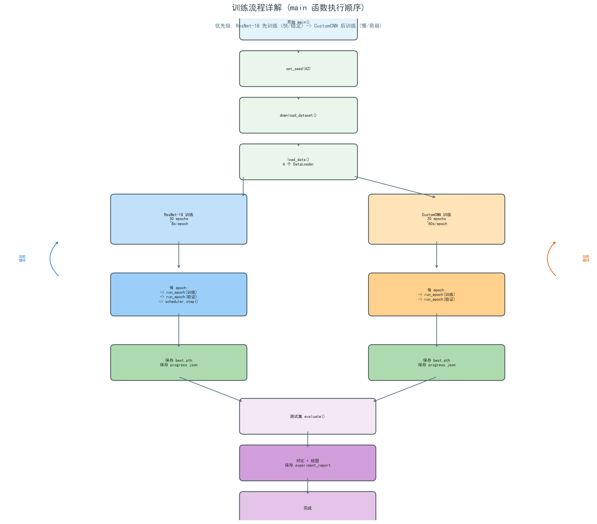
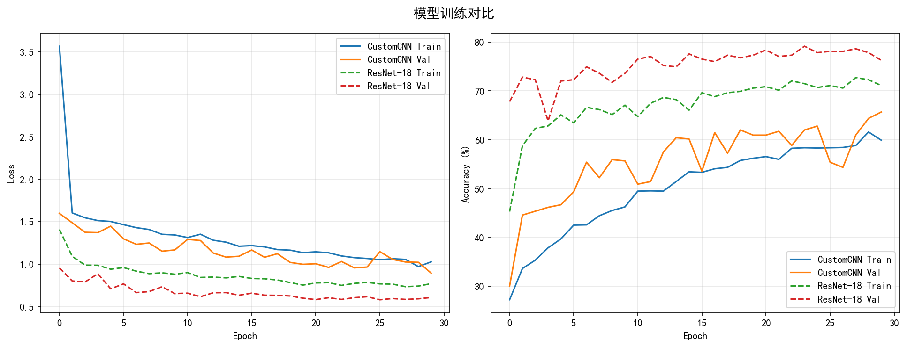
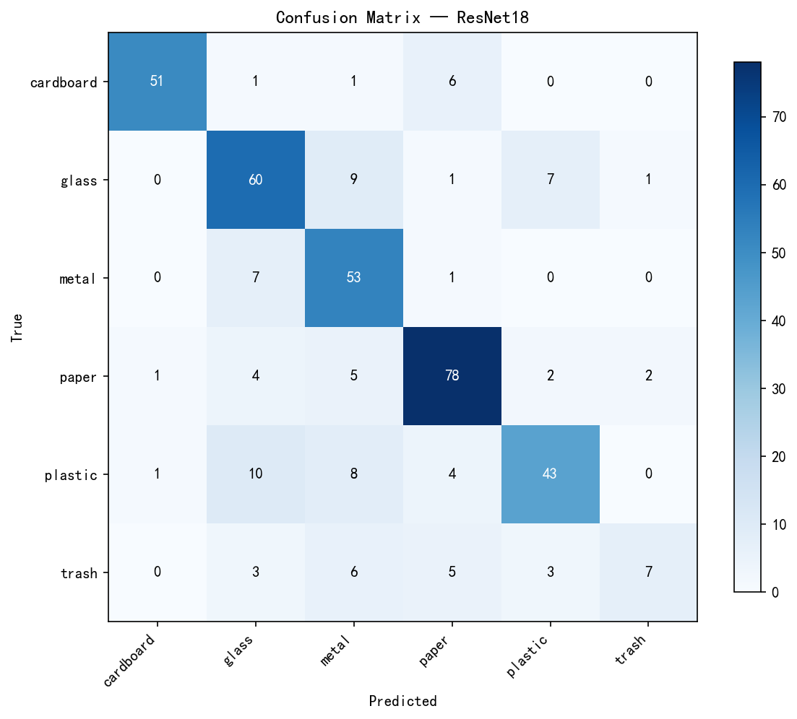
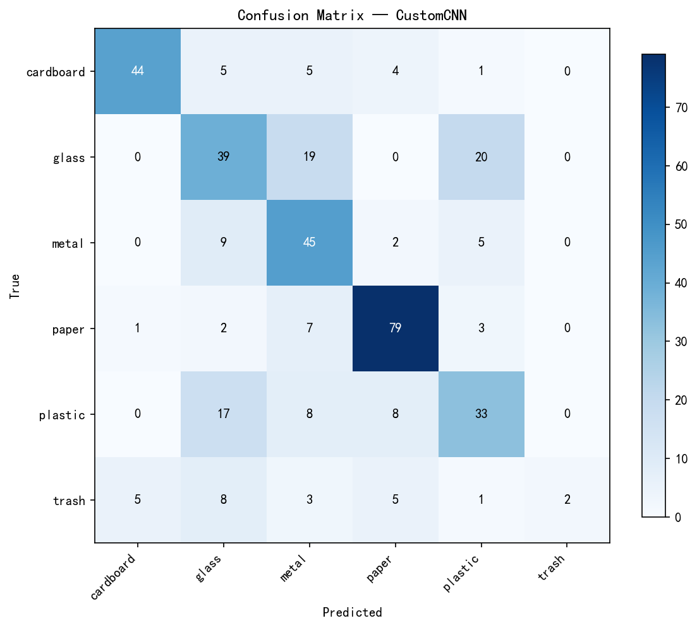

# 基于卷积神经网络的垃圾分类图像识别 — TrashNet 分类算法复现

## 项目简介

本项目针对生活垃圾自动分类的实际需求，基于 PyTorch 深度学习框架，在 TrashNet 公开数据集上复现并对比了两种图像分类方法：

1. **自定义 CNN**：从零训练的 4 层卷积神经网络（26.3M 可训练参数）
2. **ResNet-18 迁移学习**：冻结 ImageNet 预训练 backbone，仅训练分类头（13.3K 可训练参数）

实验验证了迁移学习在小规模数据集上的显著优势——仅用 0.5% 的可训练参数，实现 13.16 个百分点的性能领先。

---

## 实验环境

| 组件 | 型号/版本 |
|------|----------|
| GPU | NVIDIA GeForce RTX 4050 Laptop GPU (6GB GDDR6) |
| CUDA | 12.4 |
| PyTorch | 2.5.1 |
| Python | 3.12.4 (conda) |
| OS | Windows 11 |

### 环境搭建

```bash
# 1. 安装 PyTorch (CUDA 12.4)
conda install pytorch torchvision pytorch-cuda=12.4 -c pytorch -c nvidia

# 2. 安装其他依赖
pip install kagglehub scikit-learn matplotlib

# 3. 验证 GPU 可用
python -c "import torch; print(torch.cuda.is_available()); print(torch.cuda.get_device_name(0))"
```

**注意事项**：
- 系统需设置环境变量 `KMP_DUPLICATE_LIB_OK=TRUE` 解决 Intel MKL 与 LLVM OpenMP 冲突
- 若系统存在多个 Python 安装，确保使用 conda 环境中的 Python（已安装 PyTorch CUDA 版本）
- 国内用户建议使用 conda + 清华源安装 PyTorch，避免 pip 直接下载大文件超时

---

## 项目结构

```
project/
├── train.py                       # 主训练脚本 (468行)
│   ├── Config                     #   超参数配置类
│   ├── download_dataset()         #   数据集下载 (kagglehub)
│   ├── SubsetWithTransform        #   带独立 transform 的 Dataset 包装器
│   ├── load_data()                #   数据加载 + 70/15/15 划分
│   ├── CustomCNN                  #   自定义 CNN 模型定义
│   ├── get_resnet_model()         #   ResNet-18 迁移学习模型构建
│   ├── run_epoch()                #   单 epoch 训练/验证循环
│   ├── train_model()              #   完整训练流程 (含早停 + 进度保存)
│   ├── evaluate()                 #   测试集评估 + 混淆矩阵生成
│   ├── plot_comparison()          #   训练曲线对比图
│   └── main()                     #   主入口 (ResNet-18 → CustomCNN → 评估)
│
├── generate_docx.js               # 实验结果导出脚本 (docx-js)
│
├── outputs/                       # 实验输出
│   ├── training_comparison.png    #   训练/验证损失 & 准确率对比曲线
│   ├── cm_ResNet18.png            #   ResNet-18 混淆矩阵
│   ├── cm_CustomCNN.png           #   CustomCNN 混淆矩阵
│   ├── architecture_diagram.png   #   系统架构图
│   ├── training_pipeline.png      #   训练流程图
│   ├── experiment_report.json     #   实验数据汇总 (JSON)
│   ├── ResNet18_progress.json     #   ResNet-18 逐 epoch 训练记录
│   └── CustomCNN_progress.json    #   CustomCNN 逐 epoch 训练记录
│
├── data/                          # 数据集 (通过 kagglehub 自动下载，不上传 GitHub)
├── models/                        # 模型权重 (不上传 GitHub)
└── README.md                      # 本文件
```

---

## 数据集

### 来源

使用 [TrashNet](https://github.com/garythung/trashnet) 公开数据集（Gary Thung & Mindy Yang, 2017, MIT License），由智能手机（iPhone 7 Plus / 5S / SE）在白色背景上拍摄垃圾样本。由于原始 GitHub 仓库在国内访问受限，本项目通过 **kagglehub**（`asdasdasasdas/garbage-classification` 镜像）自动下载。

### 类别分布

| 类别 | 英文名称 | 图像数量 | 占比 |
|------|----------|----------|------|
| 纸板 | cardboard | 403 | 15.9% |
| 玻璃 | glass | 501 | 19.8% |
| 金属 | metal | 410 | 16.2% |
| 纸张 | paper | 594 | 23.5% |
| 塑料 | plastic | 482 | 19.1% |
| 其他垃圾 | trash | 137 | **5.4%** ⚠️ |

- 总样本数：2,527 张 RGB 图像
- 分辨率：512 × 384 像素
- **类别不平衡问题**：trash 类仅占 5.4%，是影响模型性能的主要因素

### 数据划分与预处理

数据集按 **70% / 15% / 15%** 比例随机划分（固定 seed=42 保证可复现）：

| 子集 | 数量 | 用途 |
|------|------|------|
| 训练集 | 1,768 张 | 模型参数更新 |
| 验证集 | 379 张 | 超参数调优 + 早停判断 |
| 测试集 | 380 张 | 最终性能评估（仅使用一次） |

**数据增强策略**（仅应用于训练集）：

| 变换 | ResNet-18 管道 | CustomCNN 管道 |
|------|---------------|---------------|
| 尺寸缩放 | Resize(224×224) | Resize(224×224) |
| 随机水平翻转 | p=0.5 | p=0.5 |
| 随机旋转 | ±15° | ±10° |
| 色彩抖动 | brightness/contrast/saturation ±0.2, hue ±0.05 | — |
| 标准化 | ImageNet 均值/标准差 | [0.5, 0.5, 0.5] |

> **设计说明**：ResNet-18 必须使用 ImageNet 统计量进行标准化，否则预训练特征将失效。CustomCNN 从零训练，使用简单的 [0.5, 0.5, 0.5] 标准化即可。

**SubsetWithTransform 设计**：PyTorch 的 `random_split` 返回的 `Subset` 没有独立 `transform`。为实现训练/验证/测试集各自独立的数据增强策略，封装了 `SubsetWithTransform` 类：

```python
class SubsetWithTransform(Dataset):
    def __init__(self, subset, transform=None):
        self.dataset = subset.dataset   # 原始 ImageFolder
        self.indices = subset.indices   # 子集索引
        self.transform = transform      # 独立的 transform
    def __getitem__(self, idx):
        img, label = self.dataset[self.indices[idx]]
        if self.transform:
            img = self.transform(img)
        return img, label
```

---

## 模型架构

### 模型一：自定义 CNN

从零训练的 4 层卷积神经网络，架构如下：

```
输入: [batch, 3, 224, 224]
                                 Kernel   Output Shape       Param #
Block 1: Conv(3→32)×2 + BN + ReLU  3×3   [B,32,112,112]      10,400
         MaxPool(2×2)
Block 2: Conv(32→64)×2 + BN + ReLU 3×3   [B,64,56,56]        55,936
         MaxPool(2×2)
Block 3: Conv(64→128)×2 + BN + ReLU 3×3  [B,128,28,28]      222,336
         MaxPool(2×2)
Block 4: Conv(128→256) + BN + ReLU 3×3   [B,256,14,14]      295,680
         MaxPool(2×2)
Flatten: 256×14×14 = 50,176
Classifier: Dropout(0.5) → FC(50176→512) → ReLU
           Dropout(0.5) → FC(512→6)
──────────────────────────────────────────────────────────
总计: 26,277,286 可训练参数
```

**设计特点**：
- 每层卷积后接 BatchNorm + ReLU，加速收敛并稳定训练
- 通道数逐块翻倍（32→64→128→256），逐步提取高层语义特征
- 双层 Dropout(0.5) 防止过拟合

### 模型二：ResNet-18 迁移学习

基于 ImageNet 预训练权重的迁移学习方案：

```
输入: [batch, 3, 224, 224] (ImageNet 标准化)
                                  可训练?
ResNet-18 Backbone (17层卷积)      ✗ 冻结 (requires_grad=False)
  ├── Conv1: 7×7, 64ch
  ├── Layer1: 2× BasicBlock(64)
  ├── Layer2: 2× BasicBlock(128)
  ├── Layer3: 2× BasicBlock(256)
  └── Layer4: 2× BasicBlock(512)
AdaptiveAvgPool → 512 维特征
Classifier: Dropout(0.5) → FC(512→256) → ReLU  ✓
           Dropout(0.3) → FC(256→6)              ✓
──────────────────────────────────────────────────────
总参数: 11,309,382  |  可训练: 132,870 (1.17%)
```

**设计决策**：

| 选择 | 方案 | 理由 |
|------|------|------|
| 冻结策略 | 全部冻结 backbone | 数据集仅 2,527 张，fine-tune 全网络会严重过拟合 |
| 分类头深度 | 双层 FC(512→256→6) | 比单层提供更强的非线性表达能力 |
| Dropout 配置 | 0.5 / 0.3 | 较强正则化应对小样本 |

---

## 训练配置

### 超参数

| 参数 | ResNet-18 | CustomCNN | 说明 |
|------|-----------|-----------|------|
| Batch Size | 32 | **16** | CNN 减小 batch 防止 6GB 显存溢出 |
| Optimizer | AdamW | AdamW | 带解耦权重衰减的 Adam |
| Learning Rate | 1×10⁻³ | 1×10⁻³ | 初始学习率 |
| Weight Decay | 1×10⁻⁴ | 1×10⁻⁴ | L2 正则化 |
| LR Scheduler | ReduceLROnPlateau | ReduceLROnPlateau | 监控验证损失 |
| Scheduler Factor | 0.5 | 0.5 | 触发时衰减为一半 |
| Scheduler Patience | 5 epochs | 5 epochs | 连续 5 轮不提升即衰减 |
| Min LR | 1×10⁻⁶ | 1×10⁻⁶ | 学习率下限 |
| Loss Function | CrossEntropyLoss | CrossEntropyLoss | 多分类标准损失 |
| Max Epochs | 30 | 30 | 含早停 (patience=10) |
| Image Size | 224×224 | 224×224 | ResNet 标准输入 |

### 训练流程

训练脚本 `train.py` 的执行顺序：

1. **数据准备**：`download_dataset()` → `load_data()` → 6 个 DataLoader
2. **ResNet-18 迁移学习**：先训练（更快更稳定，~8s/epoch × 30 ≈ 4 分钟）
3. **自定义 CNN**：后训练（batch=16 降低显存，~60s/epoch × 30 ≈ 30 分钟）
4. **测试集评估**：加载最佳 checkpoint → 计算 test accuracy + 分类报告 + 混淆矩阵
5. **可视化输出**：训练曲线对比图 + 实验报告 JSON



### 健壮性设计

| 问题 | 解决方案 |
|------|----------|
| 训练进程崩溃导致结果丢失 | 每 epoch 保存 `progress.json`；仅保存最佳 checkpoint |
| 输出缓冲导致日志不可见 | 所有 `print()` 加 `flush=True` + 环境变量 `PYTHONUNBUFFERED=1` |
| CustomCNN 显存溢出 (OOM) | 减小 batch_size: 32 → 16 |
| GitHub 被墙无法下载数据集 | 改用 kagglehub 镜像下载 |

---

## 实验结果

### 整体对比



| 指标 | ResNet-18 迁移学习 | 自定义 CNN | 差异 |
|------|-------------------|-----------|------|
| **验证准确率** | **79.16%** (epoch 24) | 65.70% (epoch 30) | +13.46% |
| **测试准确率** | **76.84%** | 63.68% | **+13.16%** |
| 总参数量 | 11,309,382 | 26,277,286 | -57% |
| 可训练参数 | **132,870** | 26,277,286 | -99.5% |
| 训练时间/epoch | ~8s | ~60s | 7.5× |
| 初始验证准确率 | 67.81% (epoch 1) | 30.08% (epoch 1) | 2.3× |

### 各类别性能 (ResNet-18)

| 类别 | Precision | Recall | F1-Score | 测试数 | 分析 |
|------|-----------|--------|----------|--------|------|
| cardboard | **96.23%** | 86.44% | **0.91** | 59 | 纹理统一，易识别 |
| paper | 82.11% | **84.78%** | 0.83 | 92 | 大面积白色背景，特征明显 |
| glass | 70.59% | 76.92% | 0.74 | 78 | 透明材质带来视觉干扰 |
| metal | 64.63% | **86.89%** | 0.74 | 61 | 高召回低精确，易误判 |
| plastic | 78.18% | 65.15% | 0.71 | 66 | 与 metal 类间混淆明显 |
| **trash** | 70.00% | **29.17%** | **0.41** | **24** | ⚠️ 样本极少，严重类别不平衡 |




### 关键发现

1. **迁移学习碾压级优势**：ResNet-18 仅训练 13.3 万参数（占总数 0.5%），性能却超越 2,627 万参数的自定义 CNN 13.16 个百分点。ImageNet 预训练的通用视觉特征（边缘→纹理→形状）对垃圾分类任务高度可迁移。

2. **预训练权重提供极佳初始化**：ResNet-18 初始验证准确率即达 67.81%，已经超过 CustomCNN 训练 30 轮的最终结果（65.70%）。

3. **类别不平衡是核心瓶颈**：trash 类训练样本仅 137 张（5.4%），ResNet-18 Recall 仅 29.17%。改善数据平衡（如过采样、Focal Loss、SMOTE）比堆叠更大模型更有意义。

4. **CustomCNN 已逼近过拟合边界**：训练后期 train_acc 持续上升（52%→61%），但 val_acc 在 62%-65% 区间波动，验证损失未同步改善——典型的过拟合信号。

5. **计算性价比高**：全部实验在消费级笔记本 GPU（RTX 4050 6GB）上完成，总训练时间约 35 分钟。ResNet-18 分类头仅 13.3 万参数，适合部署到嵌入式或边缘设备。

---

## 快速复现

### 一键运行

```bash
# 设置环境变量 (Windows)
set KMP_DUPLICATE_LIB_OK=TRUE

# 运行完整实验
python train.py
```

训练脚本将自动完成：
1. 检测/下载 TrashNet 数据集（优先本地缓存，否则通过 kagglehub 下载）
2. 划分数据集（70/15/15）并构建 DataLoader
3. 训练 ResNet-18 迁移学习模型（30 epochs，含早停）
4. 训练自定义 CNN 模型（30 epochs，含早停）
5. 在测试集上评估两个模型，打印分类报告
6. 生成混淆矩阵 PNG（`outputs/cm_*.png`）
7. 生成训练曲线对比图（`outputs/training_comparison.png`）
8. 输出实验报告 JSON（`outputs/experiment_report.json`）

### 仅使用已有模型进行评估

```python
import torch
from train import CustomCNN, get_resnet_model, evaluate, Config, load_data

# 加载数据
_, _, test_ldr, _, _, test_s = load_data()

# 加载 ResNet-18
rn = get_resnet_model(6)
rn.load_state_dict(torch.load('models/ResNet18_best.pth', weights_only=True)['model_state_dict'])
evaluate(rn, test_ldr, 'ResNet18')

# 加载 CustomCNN
cnn = CustomCNN(6)
cnn.load_state_dict(torch.load('models/CustomCNN_best.pth', weights_only=True)['model_state_dict'])
evaluate(cnn, test_s, 'CustomCNN')
```

---

## 参考文献

[1] Thung G, Yang M. TrashNet: Dataset of images of trash[DS]. GitHub repository, 2017. https://github.com/garythung/trashnet

[2] He K, Zhang X, Ren S, et al. Deep Residual Learning for Image Recognition[C]. IEEE Conference on Computer Vision and Pattern Recognition (CVPR), 2016: 770-778.

[3] Paszke A, Gross S, Massa F, et al. PyTorch: An Imperative Style, High-Performance Deep Learning Library[C]. Advances in Neural Information Processing Systems (NeurIPS), 2019: 8024-8035.

[4] Ioffe S, Szegedy C. Batch Normalization: Accelerating Deep Network Training by Reducing Internal Covariate Shift[C]. International Conference on Machine Learning (ICML), 2015: 448-456.

[5] Srivastava N, Hinton G, Krizhevsky A, et al. Dropout: A Simple Way to Prevent Neural Networks from Overfitting[J]. Journal of Machine Learning Research, 2014, 15(1): 1929-1958.

[6] Yosinski J, Clune J, Bengio Y, et al. How transferable are features in deep neural networks?[C]. Advances in Neural Information Processing Systems (NeurIPS), 2014: 3320-3328.

---

## 许可

本项目仅用于学术研究与课程论文目的。数据集 TrashNet 采用 MIT 开源协议。
